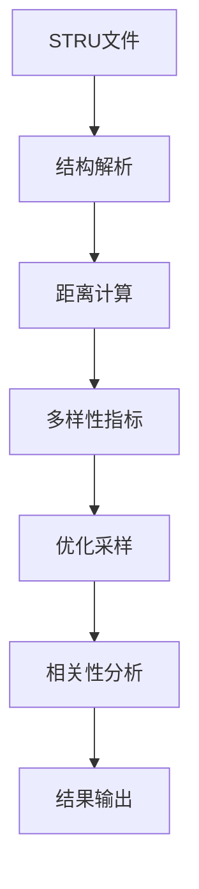

# ABACUS STRU 轨迹分析器 - 项目概览

## 📁 项目文档结构

### 主要文档

| 文档名称 | 用途 | 目标读者 |
|----------|------|----------|
| `README.md` | 项目主文档，完整使用指南 | 所有用户 |
| `CORRELATION_ANALYZER_README.md` | 相关性分析模块专门说明 | 高级用户，开发者 |
| `不同距离指标的的特性.md` | 距离指标技术对比 | 算法研究者 |
| `PROJECT_OVERVIEW.md` | 项目文档概览 | 新用户导航 |

### 核心程序文件

| 文件名 | 功能 | 文档说明 |
|--------|------|----------|
| `abacus_dist_analyzer.py` | 主程序，轨迹分析 | 详见 README.md |
| `correlation_analyzer.py` | 独立统计分析模块 | 详见 CORRELATION_ANALYZER_README.md |
| `stru_parser.py` | STRU文件解析器 | 在主文档中说明 |
| `trajectory_analyzer.py` | 轨迹分析核心算法 | 在主文档中说明 |

## 🚀 快速开始指南

### 1. 新用户入门路径

1. **阅读 `README.md`** - 了解项目功能和基本使用
2. **准备数据** - 按照文档格式要求整理数据
3. **运行基础分析** - 使用默认参数测试
4. **查看结果** - 理解输出文件含义

### 2. 高级用户路径

1. **掌握基础功能** - 完成新用户流程
2. **阅读 `CORRELATION_ANALYZER_README.md`** - 深入理解统计分析
3. **自定义参数** - 根据需求调整采样策略
4. **独立运行相关性分析** - 使用专门模块

### 3. 开发者路径

1. **理解所有文档** - 全面掌握项目结构
2. **阅读 `不同距离指标的的特性.md`** - 了解算法原理
3. **查看代码注释** - 理解实现细节
4. **扩展功能** - 基于现有框架开发

## 📊 功能模块概览

### 核心分析流程

### 关键算法

1. **距离计算**：多种策略（详见技术文档）
2. **采样优化**：幂平均距离贪心算法
3. **统计分析**：稳健的相关性和显著性检验
4. **质量控制**：自动样本量检查和过滤

## 🎯 使用场景

### 科研应用

- **分子动力学分析**：评估分子构象多样性
- **温度效应研究**：分析温度对分子行为的影响
- **构象空间探索**：识别代表性分子构象
- **统计建模**：为进一步建模提供可靠数据

### 实际案例

- 蛋白质折叠研究
- 小分子药物构象分析
- 材料动态性质研究
- 生物大分子功能关系研究

## 📈 版本演进

### v3.0 (当前版本)
- ✨ 模块化重构
- 🛡️ 统计稳健性增强
- 📊 智能输出策略
- 📖 完整文档体系

### 发展路线

- **短期目标**：性能优化，用户体验改善
- **中期目标**：支持更多文件格式，增加可视化
- **长期目标**：机器学习集成，自动化分析工具链

## 🔧 技术特色

### 统计严谨性

- 自动样本量检查
- 多重比较校正
- 效应量评估
- 稳健性验证

### 计算效率

- 多进程并行计算
- 智能内存管理
- 可配置性能参数
- 错误恢复机制

### 用户友好

- 详细的日志记录
- 清晰的结果解释
- 灵活的参数配置
- 完善的错误提示

## 📞 支持与反馈

### 获取帮助

1. **查阅文档**：首先查看相关 README 文档
2. **检查日志**：分析程序生成的日志文件
3. **验证数据**：确认输入数据格式正确
4. **提交Issue**：在 GitHub 仓库报告问题

### 贡献指南

- 代码贡献：Fork 项目并提交 Pull Request
- 文档改进：修正错误或补充说明
- 功能建议：通过 Issue 提出改进建议
- 使用反馈：分享使用经验和案例

## 🏆 致谢

感谢以下项目和工具的支持：

- **ABACUS**: 提供高质量的第一性原理计算平台
- **NumPy/SciPy**: 提供强大的科学计算基础
- **Pandas**: 提供高效的数据处理能力
- **开源社区**: 提供宝贵的代码和思路

---

**项目地址**: [GitHub - ABACUS-STRU-Analyser](https://github.com/LoveElysia1314/ABACUS-STRU-Analyser)

**作者**: LoveElysia1314

**最后更新**: 2025年8月16日
